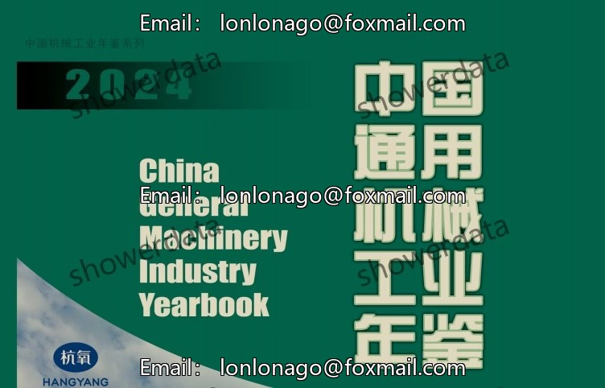
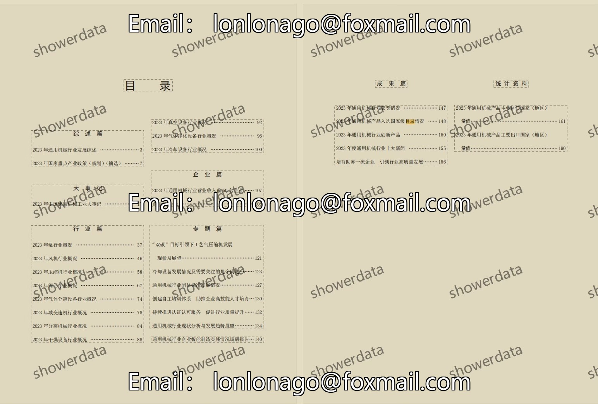
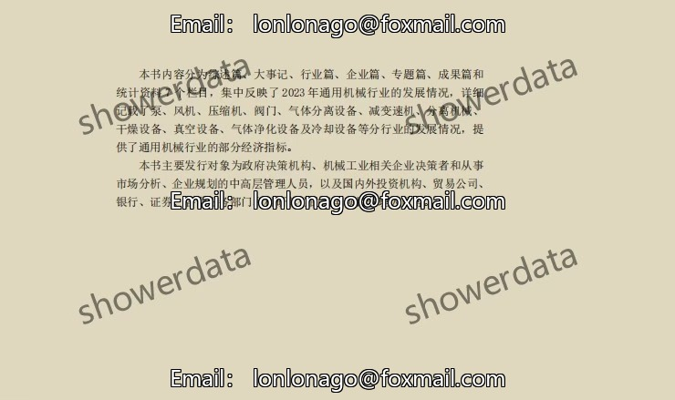

## Body

"China General Machinery Industry Annual" (2002-2024, excluding 2003 and 2005)

Data Year: The title year is the year of data compilation, so the data year needs to be one less than the title year.
See the image below for a complete display of instructions. Please confirm if you need it before purchasing! No returns or exchanges after shipment.

01. Data Introduction
The "China General Machinery Industry Annual" covers years 2002, 2004, 2006-2021, 2022-2023 (two years combined into one).

02. Indicator Details
(1) The directory is displayed in the image, please view it on your own and make an informed purchase. We do not assist in finding specific indicators; all information is here. After shipment, we do not support returns without reason.
(2) The displayed directory is for the year 2024. Different statistical methods may change over time. Academic common sense dictates that the data recorded in statistical materials is based on the previous year's data as well. This is understood.
(3) The Excel format data is compiled from original materials, containing the content of the original data but not the text content.
(4) If the material is placed in a zipped package, save the zipped package first, then download, and then extract.
(5) If there is Excel protection, you can select all and copy to a new sheet to use.

03. Data Content
Original annual editions 2002, 2004, 2006-2021, 2022-2023 (two years combined into one), 2024 PDF, no 2003, 2005
Please read carefully before purchasing. If you are sensitive to formatting, do not buy!

## Images

Here is a pay link on Stripe ( https://buy.stripe.com/3cs8yP7sY87d0vu9AB ). Please contact me lonlonago@foxmail.com after funding $89, and I will send you a complete data files , thank you!

